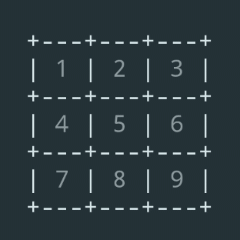

# Tic Tac Toe (C) with Minimax AI



## Overview

This is a terminal-based Tic Tac Toe game written in C, built as part of my process of learning the language. It started as a simple implementation and gradually evolved to include an AI opponent using the Minimax algorithm.

The goal of this project was not to build a perfect game, but to explore how C works in practice while solving a familiar problem.

## Features

* Play against an AI opponent
* Minimax algorithm for optimal decision making
* Smart opening moves (center and corners priority)
* Score tracking across multiple rounds
* Simple and interactive terminal UI
* Input validation and game state handling

## How It Works

The AI uses the Minimax algorithm to evaluate all possible game states and choose the best move.

* Early game: prioritizes strategic positions (center, corners)
* Mid/Late game: switches to Minimax for optimal play
* The AI is designed to be unbeatable if played correctly

Game state evaluation:

* `+10` → AI wins
* `-10` → Player wins
* `0` → Draw

Core logic can be found in the Minimax implementation: 

## Controls

* Enter a number from **1–9** to place your move
* Press **0** to quit the game anytime

Board layout:

```
1 | 2 | 3
4 | 5 | 6
7 | 8 | 9
```

## Running the Game

### Compile

```bash
gcc main.c -o tictactoe
```

### Run

```bash
./tictactoe
```

## Notes

* This project was built during the early stages of learning C
* Code may not follow best practices or optimal structure
* There are likely areas for improvement and refactoring

This is intentional — the focus is on learning and experimentation.

---

This project is part of a larger collection of mini games built while learning new programming languages.
