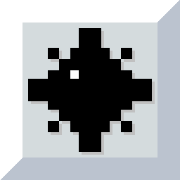
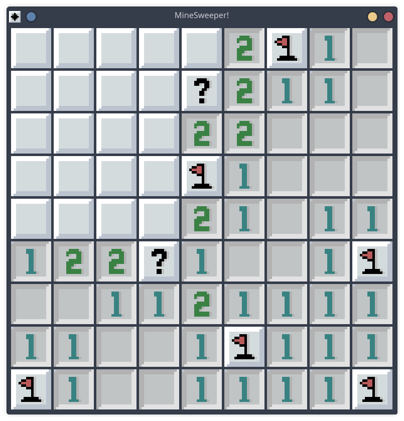

<h1>
  
  MineSweeper (C)
</h1>




## Overview

This project was built primarily to explore the **Raylib** game development library while continuing my habit of creating small games when learning new technologies.

Raylib absolutely lives up to its reputation. The API is simple, intuitive, and easy to get started with, which made the development process surprisingly enjoyable. I was able to build the core game in about **two days**, and it likely would have taken even less time if I hadn't decided to create custom artwork for the project.

## Features

* Classic Minesweeper gameplay
* Custom artwork and visual assets
* Mouse-based interaction
* Win and lose conditions
* Built using C and Raylib

## Quickstart

### Prerequisites

* GCC
* Make
* Raylib

### Build

```
make build
```

### Run
```
make run
```
Alternatively, after building:
```
./bin/game
```
## Important Note

Like the other projects in this repository, this game was created as part of a learning experience.

Because of that:

* The code is not intended to follow industry standards
* There may be bugs, inefficiencies, or design flaws
* Some implementations were chosen for simplicity rather than scalability

The goal was to understand Raylib and enjoy the process of building a complete game from scratch.

## What I Learned

* Setting up and using Raylib
* Rendering textures and sprites
* Handling user input in Raylib
* Managing game state in Raylib
* Organizing a small game project in C
* Creating and integrating custom game assets

## Future Plans

I would like to continue improving the game by adding:

- [ ] Bomb counter displaying the number of remaining flags
- [ ] Sound effects and audio feedback
- [ ] Multiple difficulty levels
- [ ] Custom board layouts

## Final Thoughts

This was one of the enjoyable learning projects I've worked on. Raylib made game development feel approachable without getting in the way, and I can easily see why it is frequently recommended for beginners and hobby game developers.