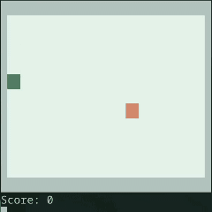

# Snake Game (Go - Terminal)



---

## Overview

A simple Snake game built in Go while learning the language.

The goal was to experiment with basic game loops, terminal rendering, and a bit of concurrency using goroutines.

---

## Features

* Real-time movement with arrow keys
* Dynamic board based on terminal size
* Increasing speed as you score
* Wall and self collision detection
* Random fruit spawning
* Simple score tracking
* Colored output using ANSI escape codes

---

## Controls

```
Arrow Keys  → Move
q           → Quit
```

---

## How It Works

* A main loop updates and redraws the game continuously
* A separate goroutine listens for keyboard input
* The snake moves based on the current direction
* Eating fruit increases score and length

---

## Running the Game

### Install dependency

```bash id="b3k9s2"
go get golang.org/x/term
```

### Run

```bash id="x8m2p1"
go run main.go
```

---

## Notes

* Built while learning Go
* Not production-level code
* Focused on understanding basics and experimenting

---

Part of a collection of mini games made while learning different languages.
