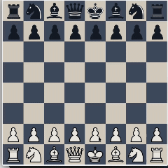

# Chess (Java - Swing)



## Overview

A 2-player Chess game built in Java using Swing, created while learning the language through hands-on projects.

This is one of the projects I keep coming back to over time, adding small improvements, fixing issues, and experimenting with ideas. It’s easily the project I’m most proud of in this collection.

## Features

* 2-player local gameplay
* Piece movement with basic validation
* Sound effects for moves, captures, and invalid actions
* GUI rendering using Java Swing
* Classic chess piece styling

## Controls

* Mouse-based interaction
* Click to select and move pieces

## What This Project Focuses On

This project was mainly about understanding and applying core OOP concepts in Java:

* **Encapsulation** → Each piece handles its own logic
* **Inheritance** → All pieces extend a base `Piece` class
* **Polymorphism** → Movement rules differ per piece
* **Separation of concerns** → UI, logic, and input are split across classes

## How It Works

* Rendering and game loop are handled using Swing (`GamePanel`)
* Mouse input is used for selecting and moving pieces
* Each piece implements its own movement logic
* Sound effects are triggered for:

  * Moves
  * Captures
  * Invalid actions

## Limitations

* No checkmate or proper game-end detection
* Missing special moves:

  * Pawn promotion
  * En passant
  * Castling

This was built early in the learning process, so some core chess rules are simplified or not implemented.


## Running the Game

### Compile

```bash id="c9v2b1"
javac main/*.java pieces/*.java
```

### Run

```bash id="k4m8n2"
java main.Main
```

## Notes

* Built while learning Java and Swing
* Not production-level code
* This is a project I revisit occasionally to improve over time

## What I Learned

* Structuring a multi-file Java project
* Using Swing for GUI rendering
* Applying OOP concepts in a practical setting
* Handling interactions between UI, input, and game logic

---

Part of a collection of mini games built while learning different programming languages.
